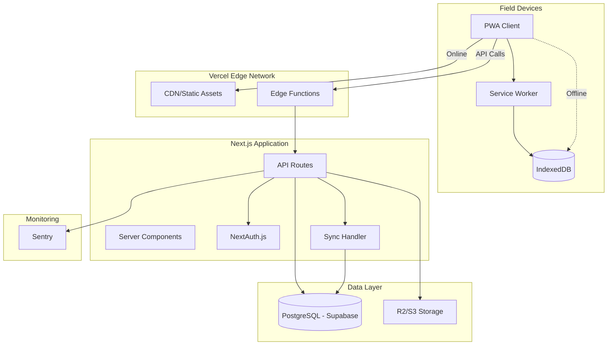

# 3. High-Level Architecture

### 3.1 System Architecture Diagram



### 3.2 Architectural Layers

#### 1. Presentation Layer (PWA Client)
**Responsibility:** User interface, offline operation, local data management

**Technologies:** Next.js, React, Zustand, IndexedDB

**Key Features:**
- Role-based dashboards with dynamic navigation
- Offline-capable forms with auto-save
- GPS integration with manual fallback
- Media capture with compression
- Sync queue visualization
- Real-time status indicators

**Critical Paths:**
- Assessment creation: Form → Validation → IndexedDB → Sync Queue
- Response planning: Form → Assessment Link → IndexedDB → Sync Queue
- Role switching: Session Save → Role Change → Session Restore

#### 2. Service Worker Layer
**Responsibility:** Network interception, cache management, background sync

**Technologies:** Workbox (via next-pwa)

**Key Features:**
- Offline page fallback
- Static asset caching (images, CSS, JS)
- API response caching with stale-while-revalidate
- Background sync triggers
- Cache versioning and invalidation

**Caching Strategies:**
- Static assets: CacheFirst (30 days)
- API calls: NetworkFirst (10s timeout, 24h cache)
- Images: CacheFirst with size limits
- Forms: NetworkOnly (never cache POST/PUT)

#### 3. Application Layer (Next.js)
**Responsibility:** Business logic, authentication, API endpoints

**Technologies:** Next.js API Routes, NextAuth.js, Prisma

**Key Features:**
- RESTful API with consistent patterns
- JWT-based authentication with role context
- Role-based authorization middleware
- Request validation with Zod schemas
- Error handling with standardized responses

**API Organization:**
```
/api/v1/
  /auth/          # Authentication endpoints
  /users/         # User management
  /incidents/     # Incident CRUD
  /entities/      # Affected entity management
  /assessments/   # Assessment workflows
  /responses/     # Response workflows
  /verification/  # Verification actions
  /donors/        # Donor management
  /sync/          # Sync endpoints
  /dashboard/     # Dashboard data aggregation
```

#### 4. Synchronization Layer
**Responsibility:** Offline data sync, conflict resolution, queue processing

**Technologies:** Custom sync engine, Prisma transactions

**Key Features:**
- Batch sync operations for efficiency
- Last-write-wins conflict resolution
- Retry logic with exponential backoff
- Sync status tracking per item
- Conflict logging for coordinator review

**Sync Flow:**
1. Client detects online status
2. Retrieves pending items from IndexedDB sync queue
3. Batches items by type (assessments, responses, media)
4. Sends to `/api/v1/sync/push` endpoint
5. Backend validates, detects conflicts, applies changes
6. Returns sync results with new server IDs
7. Client updates IndexedDB with server IDs, clears queue

#### 5. Data Layer
**Responsibility:** Data persistence, file storage, audit trails

**Technologies:** PostgreSQL (Supabase), R2/S3, Prisma

**Key Features:**
- ACID-compliant transactions
- Audit trail for all changes
- Media storage with CDN
- Automated backups (managed by Supabase)
- Point-in-time recovery capability

**Data Flow:**
- Writes: API → Prisma → PostgreSQL
- Reads: API → Prisma → Cache → PostgreSQL
- Media: Upload → API → R2 → CDN URL → Database
- Audit: Trigger → Audit table (automatic)

---

