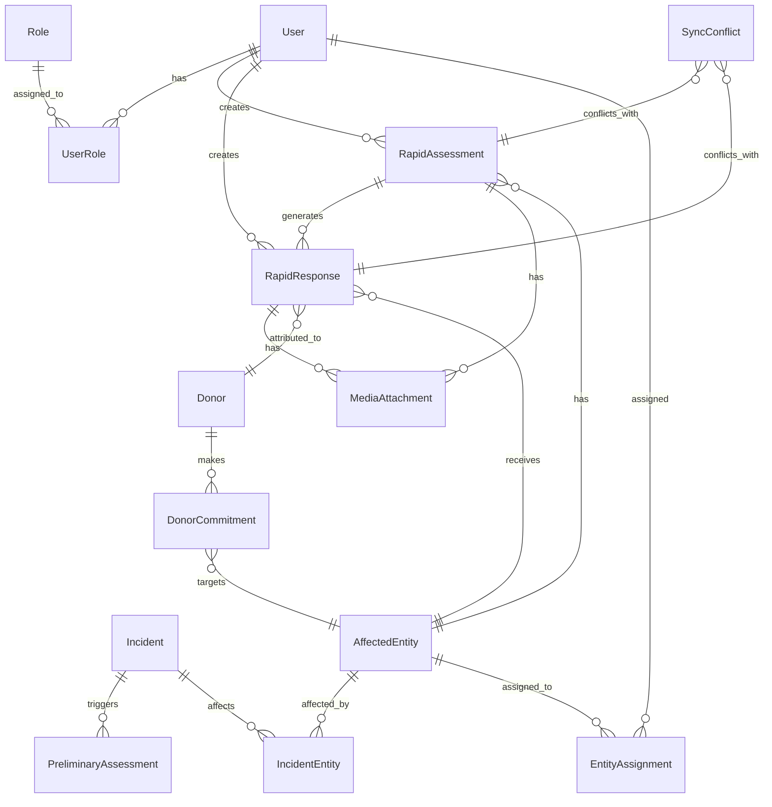

# 5.2 Entity Relationship Overview

```mermaid
erDiagram
    User ||--o{ UserRole : has
    Role ||--o{ UserRole : assigned_to
    User ||--o{ RapidAssessment : creates
    User ||--o{ RapidResponse : creates
    User ||--o{ EntityAssignment : assigned
    
    Incident ||--o{ PreliminaryAssessment : triggers
    Incident ||--o{ IncidentEntity : affects
    
    AffectedEntity ||--o{ IncidentEntity : affected_by
    AffectedEntity ||--o{ RapidAssessment : has
    AffectedEntity ||--o{ RapidResponse : receives
    AffectedEntity ||--o{ EntityAssignment : assigned_to
    
    RapidAssessment ||--o{ RapidResponse : generates
    RapidAssessment ||--o{ MediaAttachment : has
    
    RapidResponse ||--o{ MediaAttachment : has
    RapidResponse }o--|| Donor : attributed_to
    
    Donor ||--o{ DonorCommitment : makes
    DonorCommitment }o--|| AffectedEntity : targets
    
    SyncConflict }o--|| RapidAssessment : conflicts_with
    SyncConflict }o--|| RapidResponse : conflicts_with
```

---

