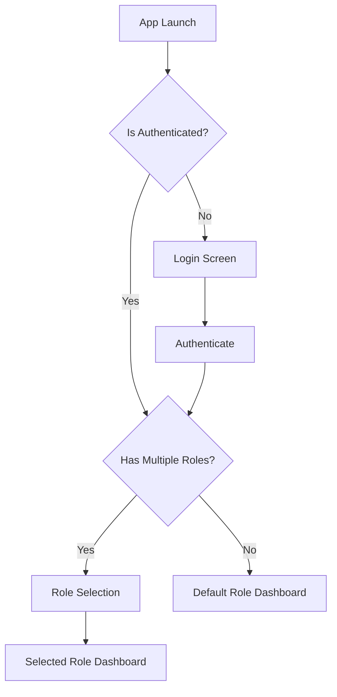
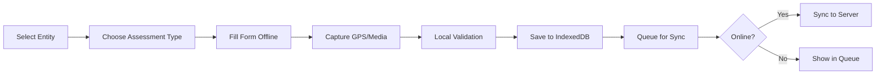
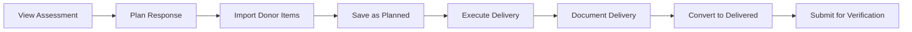

# 2. User Flows & Navigation

## 2.1 Authentication Flow



**Implementation Notes:**
- JWT stored in secure httpOnly cookie
- Role context in Zustand store
- Persistent role selection in localStorage
- Automatic role restoration on app restart

## 2.2 Role-Based Navigation Structure

### Assessor Navigation
```
/assessor
├── /dashboard          # Overview & queue
├── /assessments
│   ├── /new           # Create new assessment
│   ├── /preliminary   # Preliminary assessments
│   └── /rapid         # Rapid assessments (6 types)
├── /entities          # Assigned entities
└── /sync             # Sync status & queue
```

### Coordinator Navigation
```
/coordinator
├── /dashboard         # Crisis Management Dashboard
├── /verification
│   ├── /assessments  # Assessment queue
│   └── /responses    # Response queue
├── /incidents        # Incident management
├── /entities         # Entity assignment
├── /monitoring       # Situation Awareness Dashboard
└── /settings        # Auto-approval config
```

### Responder Navigation
```
/responder
├── /dashboard        # Overview & assignments
├── /responses
│   ├── /planned     # Planning interface
│   └── /delivered   # Delivery documentation
├── /entities        # Assigned entities
└── /imports        # Donor commitment imports
```

### Donor Navigation
```
/donor
├── /dashboard       # Performance & leaderboard
├── /commitments    # Commitment management
├── /entities       # Entity insights
└── /reports       # Performance reports
```

## 2.3 Core User Flows

### Assessment Creation Flow


### Response Planning to Delivery Flow

