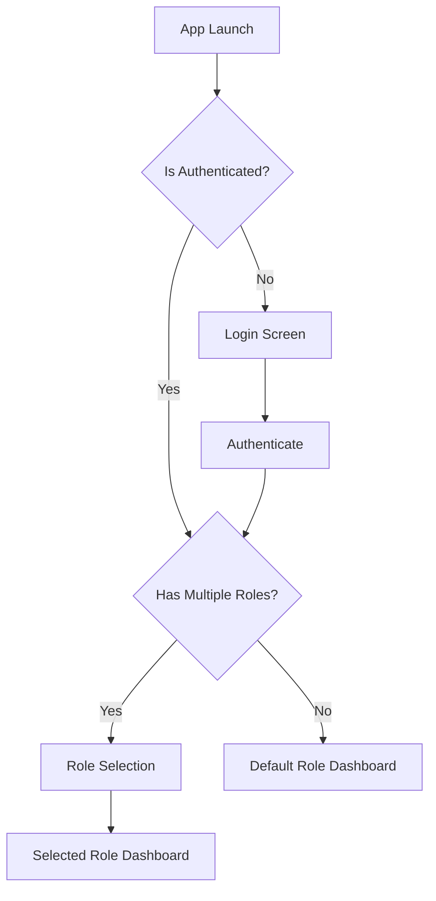
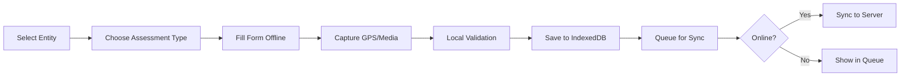
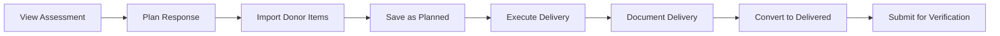

# Disaster Management PWA - Frontend Specification Document

## 1. Technical Architecture

### 1.1 Technology Stack

**Core Framework:**
- **Next.js 14** with App Router
  - File-based routing for predictable patterns
  - Server components for optimal performance
  - Built-in API routes for backend integration
  - Excellent PWA support with next-pwa

**State Management:**
- **Zustand** - Lightweight, TypeScript-friendly
  - Offline queue store
  - Sync status store
  - User/role context store
  - Entity assignment store

**UI Components:**
- **Shadcn/ui** - Copy-paste components
  - Consistent design patterns
  - Built on Radix UI primitives
  - Tailwind CSS for styling
  - Fully accessible by default

**Data Layer:**
- **Prisma** - Type-safe database client
- **Dexie.js** - IndexedDB wrapper for offline storage
- **React Query/TanStack Query** - Server state management with offline support

**PWA Infrastructure:**
- **next-pwa** - Service worker generation
- **Workbox** - Advanced caching strategies
- **IndexedDB** via Dexie for offline data

### 1.2 Project Structure

```
src/
├── app/                    # Next.js App Router
│   ├── (auth)/            # Auth-required routes
│   │   ├── assessor/      # Assessor role pages
│   │   ├── coordinator/  # Coordinator role pages
│   │   ├── responder/    # Responder role pages
│   │   ├── donor/        # Donor role pages
│   │   └── admin/        # Admin role pages
│   ├── api/              # API routes
│   └── layout.tsx        # Root layout with PWA setup
├── components/
│   ├── ui/              # Shadcn/ui components
│   ├── forms/           # Assessment/Response forms
│   ├── dashboards/      # Dashboard components
│   └── shared/          # Shared components
├── lib/
│   ├── stores/          # Zustand stores
│   ├── db/              # Dexie database schemas
│   ├── sync/            # Sync engine logic
│   └── utils/           # Utility functions
├── hooks/               # Custom React hooks
└── types/              # TypeScript definitions
```

## 2. User Flows & Navigation

### 2.1 Authentication Flow



**Implementation Notes:**
- JWT stored in secure httpOnly cookie
- Role context in Zustand store
- Persistent role selection in localStorage
- Automatic role restoration on app restart

### 2.2 Role-Based Navigation Structure

#### Assessor Navigation
```
/assessor
├── /dashboard          # Overview & queue
├── /assessments
│   ├── /new           # Create new assessment
│   ├── /preliminary   # Preliminary assessments
│   └── /rapid         # Rapid assessments (6 types)
├── /entities          # Assigned entities
└── /sync             # Sync status & queue
```

#### Coordinator Navigation
```
/coordinator
├── /dashboard         # Crisis Management Dashboard
├── /verification
│   ├── /assessments  # Assessment queue
│   └── /responses    # Response queue
├── /incidents        # Incident management
├── /entities         # Entity assignment
├── /monitoring       # Situation Awareness Dashboard
└── /settings        # Auto-approval config
```

#### Responder Navigation
```
/responder
├── /dashboard        # Overview & assignments
├── /responses
│   ├── /planned     # Planning interface
│   └── /delivered   # Delivery documentation
├── /entities        # Assigned entities
└── /imports        # Donor commitment imports
```

#### Donor Navigation
```
/donor
├── /dashboard       # Performance & leaderboard
├── /commitments    # Commitment management
├── /entities       # Entity insights
└── /reports       # Performance reports
```

### 2.3 Core User Flows

#### Assessment Creation Flow


#### Response Planning to Delivery Flow


## 3. UI Component Specifications

### 3.1 Layout Components

#### AppShell Component
```tsx
// Primary layout wrapper with offline indicator
interface AppShellProps {
  role: UserRole;
  children: React.ReactNode;
}

// Features:
- Responsive sidebar (collapsible on mobile)
- Role switcher dropdown (top-right)
- Offline/Online status indicator
- Sync queue badge with count
- Breadcrumb navigation
- PWA install prompt
```

#### OfflineIndicator Component
```tsx
// Visual indicator for connectivity status
// Position: Fixed top banner or corner badge
// States:
- Online (green dot/banner)
- Offline (orange dot/banner with "Offline Mode")
- Syncing (animated pulse)
- Sync Error (red with retry button)
```

### 3.2 Form Components

#### AssessmentForm Component Suite
```tsx
// Modular form system for all 6 assessment types
interface AssessmentFormProps {
  type: 'health' | 'wash' | 'shelter' | 'food' | 'security' | 'population';
  entityId: string;
  mode: 'create' | 'edit' | 'view';
}

// Core Features:
- Dynamic field rendering based on type
- Offline validation with Zod schemas
- Auto-save to IndexedDB every 30 seconds
- GPS capture with manual fallback
- Media attachment with compression
- Progress indicator for long forms
- Boolean gap indicators with visual feedback
```

#### Field Components
```tsx
// Reusable field components optimized for offline use

<BooleanField />       // Toggle with clear yes/no states
<GPSField />          // Auto-capture with manual entry
<MediaField />        // Photo capture with location stamps
<QuantityField />     // Numeric with unit selection
<TextAreaField />     // Multi-line with character count
<DateTimeField />     // Date/time picker with current default
```

#### Navigation Pane
```tsx
// Enhanced Navigation Sidebar Component Structure
interface NavigationSidebarProps {
  currentRole: Role;
  user: User;
  syncQueueCount: number;
  isOnline: boolean;
}

// Layout Structure:
<aside className="w-64 bg-white border-r h-screen flex flex-col">
  {/* Role Header Section */}
  <div className="p-4 border-b bg-blue-50">
    <div className="flex items-center justify-between">
      <div>
        <p className="text-xs text-gray-500">Active Role</p>
        <h2 className="font-semibold text-lg">{role.name}</h2>
      </div>
      <RoleSwitcher /> {/* Dropdown for role change */}
    </div>
  </div>

  {/* User Info */}
  <div className="px-4 py-3 border-b">
    <div className="flex items-center space-x-3">
      <Avatar user={user} />
      <div className="flex-1">
        <p className="text-sm font-medium">{user.name}</p>
        <p className="text-xs text-gray-500">{user.email}</p>
      </div>
    </div>
  </div>

  {/* Connection Status */}
  <div className="px-4 py-2 border-b">
    <ConnectionStatus isOnline={isOnline} syncCount={syncQueueCount} />
  </div>

  {/* Navigation Items */}
  <nav className="flex-1 overflow-y-auto p-4">
    <div className="space-y-1">
      {roleNavItems.map(item => (
        <NavItem key={item.path} {...item} />
      ))}
    </div>
  </nav>

  {/* Quick Actions */}
  <div className="p-4 border-t">
    <QuickActions role={role} />
  </div>
</aside>

// Breadcrumb integrated with top header
<header className="h-14 border-b bg-white">
  <div className="flex items-center h-full px-4">
    <Breadcrumbs />
    <div className="ml-auto flex items-center space-x-4">
      <NotificationBell />
      <SyncIndicator />
      <ProfileMenu />
    </div>
  </div>
</header>
```

#### Navigation Structure by Role
```tsx
// Navigation configuration per role
const navigationConfig = {
  assessor: [
    {
      label: 'Dashboard',
      icon: Home,
      path: '/assessor/dashboard',
      badge: null
    },
    {
      label: 'Assessments',
      icon: FileText,
      path: '/assessor/assessments',
      children: [
        { label: 'New Assessment', path: '/assessor/assessments/new' },
        { label: 'Preliminary', path: '/assessor/assessments/preliminary' },
        { label: 'Rapid (Health)', path: '/assessor/assessments/health' },
        { label: 'Rapid (WASH)', path: '/assessor/assessments/wash' },
        // ... other assessment types
      ]
    },
    {
      label: 'My Entities',
      icon: MapPin,
      path: '/assessor/entities',
      badge: assignedEntityCount
    },
    {
      label: 'Sync Queue',
      icon: Cloud,
      path: '/assessor/sync',
      badge: syncQueueCount,
      badgeColor: 'orange'
    }
  ],
  
  coordinator: [
    {
      label: 'Crisis Dashboard',
      icon: AlertTriangle,
      path: '/coordinator/dashboard',
      badge: pendingCount,
      badgeColor: 'red'
    },
    {
      label: 'Verification',
      icon: CheckCircle,
      path: '/coordinator/verification',
      children: [
        { 
          label: 'Assessments', 
          path: '/coordinator/verification/assessments',
          badge: pendingAssessments 
        },
        { 
          label: 'Responses', 
          path: '/coordinator/verification/responses',
          badge: pendingResponses 
        }
      ]
    },
    // ... rest of coordinator items
  ]
};
```

### 3.3 Dashboard Components

#### Crisis Management Dashboard
```tsx
// Three-column layout for coordinators
interface CrisisDashboardProps {
  queues: {
    assessments: QueueItem[];
    responses: QueueItem[];
  };
  conflicts: ConflictItem[];
  metrics: DashboardMetrics;
}

// Layout:
- Left: Verification queues with inline actions
- Center: Resource management & assignments
- Right: Conflict log & metrics
- Real-time updates via polling/WebSocket
```

#### Situation Awareness Dashboard
```tsx
// Three-panel monitoring interface
interface SituationDashboardProps {
  incident: Incident;
  entities: AffectedEntity[];
  assessments: Assessment[];
}

// Panel Structure:
- Left Panel (300px):
  - Incident selector dropdown
  - Duration & impact stats
  - Status indicators
  
- Center Panel (flex):
  - Entity selector (filtered)
  - Assessment summary grid
  - Gap analysis matrix
  - Interactive map
  
- Right Panel (350px):
  - Gap summary across entities
  - Priority scoring
  - Export actions
```

#### Queue Management Component
```tsx
// Reusable queue for assessments/responses
interface QueueProps {
  items: QueueItem[];
  type: 'assessment' | 'response';
  onVerify: (id: string, action: 'approve' | 'reject') => void;
}

// Features:
- Expandable row details
- Inline approve/reject buttons
- Rejection reason modal
- Sort by: date, priority, entity
- Filter by: status, type, assignee
- Batch actions support
```

### 3.4 Map Components

#### InteractiveMap Component
```tsx
// Offline-capable map with entity visualization
interface MapProps {
  entities: EntityLocation[];
  selectedEntity?: string;
  showDonors?: boolean;
  gapSeverity?: GapLevel;
}

// Implementation:
- Use Mapbox GL JS with offline tiles
- Cluster markers for performance
- Color coding by gap severity
- Click handlers for entity selection
- Zoom to selected entity
- Fallback to static image if offline tiles unavailable
```

### 3.5 Sync Components

#### SyncQueue Component
```tsx
// Visual queue management interface
interface SyncQueueProps {
  queue: SyncItem[];
  onRetry: (id: string) => void;
  onCancel: (id: string) => void;
}

// Display:
- List of pending items with status
- Progress bar for active sync
- Retry/cancel actions per item
- Clear completed button
- Conflict resolution links
```

## 4. State Management Patterns

### 4.1 Zustand Store Structure

```typescript
// stores/authStore.ts
interface AuthStore {
  user: User | null;
  currentRole: Role | null;
  availableRoles: Role[];
  switchRole: (role: Role) => void;
  logout: () => void;
}

// stores/offlineStore.ts
interface OfflineStore {
  isOnline: boolean;
  syncQueue: SyncItem[];
  conflicts: Conflict[];
  addToQueue: (item: SyncItem) => void;
  processQueue: () => Promise<void>;
  resolveConflict: (id: string) => void;
}

// stores/entityStore.ts
interface EntityStore {
  assignedEntities: AffectedEntity[];
  selectedEntity: string | null;
  entityAssessments: Map<string, Assessment[]>;
  loadEntityData: (entityId: string) => Promise<void>;
}

// stores/formStore.ts
interface FormStore {
  drafts: Map<string, FormDraft>;
  saveDraft: (formId: string, data: any) => void;
  loadDraft: (formId: string) => FormDraft | null;
  clearDraft: (formId: string) => void;
}
```

### 4.2 Offline Data Patterns

```typescript
// Dexie schema for IndexedDB
class DmsDatabase extends Dexie {
  assessments: Table<Assessment, string>;
  responses: Table<Response, string>;
  syncQueue: Table<SyncItem, string>;
  conflicts: Table<Conflict, string>;
  cache: Table<CacheItem, string>;

  constructor() {
    super('DmsDatabase');
    this.version(1).stores({
      assessments: 'id, entityId, type, status, syncStatus',
      responses: 'id, assessmentId, status, syncStatus',
      syncQueue: '++id, type, timestamp, retryCount',
      conflicts: 'id, entityType, resolvedAt',
      cache: 'key, timestamp, expiresAt'
    });
  }
}
```

## 5. UI/UX Requirements

### 5.1 Visual Design System

#### Color Palette
```css
/* Semantic colors for gap analysis and status */
--success: #10b981;     /* No gaps, verified */
--warning: #f59e0b;     /* Single gap, pending */
--danger: #ef4444;      /* Multiple gaps, rejected */
--info: #3b82f6;        /* Informational */
--offline: #f97316;     /* Offline indicator */

/* Neutral palette */
--background: #ffffff;
--foreground: #0f172a;
--muted: #f1f5f9;
--border: #e2e8f0;
```

#### Typography
```css
/* Using system fonts for performance */
--font-sans: -apple-system, BlinkMacSystemFont, "Segoe UI", Roboto, sans-serif;
--font-mono: "SF Mono", Monaco, "Cascadia Code", monospace;

/* Scale */
--text-xs: 0.75rem;
--text-sm: 0.875rem;
--text-base: 1rem;
--text-lg: 1.125rem;
--text-xl: 1.25rem;
--text-2xl: 1.5rem;
```

#### Component Spacing
```css
/* Consistent spacing scale */
--space-1: 0.25rem;
--space-2: 0.5rem;
--space-3: 0.75rem;
--space-4: 1rem;
--space-6: 1.5rem;
--space-8: 2rem;
```

### 5.2 Responsive Breakpoints

```css
/* Mobile-first approach */
@media (min-width: 640px)  /* sm: tablets */
@media (min-width: 768px)  /* md: small laptops */
@media (min-width: 1024px) /* lg: desktops */
@media (min-width: 1280px) /* xl: large screens */

/* Dashboard-specific breakpoints */
- Mobile: Single column, stacked panels
- Tablet: Two columns, collapsible sidebar
- Desktop: Three columns, all panels visible
```

### 5.3 Accessibility Requirements

#### WCAG 2.1 AA Compliance
- Color contrast minimum 4.5:1 for normal text
- Focus indicators on all interactive elements
- Keyboard navigation support throughout
- Screen reader announcements for status changes
- ARIA labels for complex components
- Skip navigation links

#### Form Accessibility
```tsx
// All forms must include:
- Label-input associations
- Error message associations
- Required field indicators
- Validation feedback in screen reader
- Fieldset grouping for related fields
```

### 5.4 Performance Requirements

#### Initial Load
- First Contentful Paint < 1.5s
- Time to Interactive < 3s
- Lighthouse score > 90

#### Runtime Performance
- Form input lag < 50ms
- Dashboard update < 30s
- Smooth scrolling (60fps)
- Image lazy loading
- Virtual scrolling for long lists

#### Offline Performance
- Service worker activation < 1s
- Offline form access < 1s
- IndexedDB operations < 100ms
- Background sync without UI blocking

## 6. Component Implementation Guidelines

### 6.1 Form Implementation Pattern

```tsx
// Example: Health Assessment Form Component
'use client';

import { useForm } from 'react-hook-form';
import { zodResolver } from '@hookform/resolvers/zod';
import { healthAssessmentSchema } from '@/lib/schemas';
import { useOfflineStore } from '@/lib/stores/offlineStore';
import { GPSField, MediaField, BooleanField } from '@/components/forms';

export function HealthAssessmentForm({ entityId }: { entityId: string }) {
  const { addToQueue } = useOfflineStore();
  
  const form = useForm({
    resolver: zodResolver(healthAssessmentSchema),
    defaultValues: {
      entityId,
      assessmentType: 'health',
      timestamp: new Date(),
    }
  });

  // Auto-save to IndexedDB
  useEffect(() => {
    const interval = setInterval(() => {
      const data = form.getValues();
      saveDraft('health', entityId, data);
    }, 30000);
    return () => clearInterval(interval);
  }, []);

  const onSubmit = async (data: HealthAssessment) => {
    // Save to IndexedDB
    await db.assessments.add(data);
    
    // Add to sync queue
    addToQueue({
      type: 'assessment',
      data,
      timestamp: Date.now(),
    });
    
    // Navigate based on online status
    if (isOnline) {
      await syncImmediately(data);
    }
    router.push('/assessor/dashboard');
  };

  return (
    <Form {...form}>
      <form onSubmit={form.handleSubmit(onSubmit)}>
        {/* Gap-indicating boolean fields */}
        <BooleanField
          name="hasFunctionalClinic"
          label="Functional Clinic Available"
          description="Gap if FALSE"
          showGapIndicator
        />
        
        <BooleanField
          name="hasEmergencyServices"
          label="Emergency Services Available"
          description="Gap if FALSE"
          showGapIndicator
        />

        {/* GPS and Media capture */}
        <GPSField name="coordinates" />
        <MediaField name="photos" maxFiles={3} />
        
        <Button type="submit">
          {isOnline ? 'Submit' : 'Save Offline'}
        </Button>
      </form>
    </Form>
  );
}
```

### 6.2 Dashboard Implementation Pattern

```tsx
// Example: Crisis Management Dashboard
'use client';

import { useQuery } from '@tanstack/react-query';
import { useOfflineStore } from '@/lib/stores/offlineStore';
import { QueuePanel, ResourcePanel, ConflictPanel } from '@/components/dashboards';

export function CrisisManagementDashboard() {
  const { isOnline } = useOfflineStore();
  
  // Polling for real-time updates
  const { data: queues } = useQuery({
    queryKey: ['verification-queues'],
    queryFn: fetchVerificationQueues,
    refetchInterval: isOnline ? 30000 : false,
    staleTime: 20000,
  });

  return (
    <div className="grid grid-cols-1 lg:grid-cols-3 gap-4 h-full">
      {/* Left: Verification Queues */}
      <div className="lg:col-span-1 overflow-y-auto">
        <QueuePanel
          assessments={queues?.assessments || []}
          responses={queues?.responses || []}
          onVerify={handleVerification}
        />
      </div>
      
      {/* Center: Resource Management */}
      <div className="lg:col-span-1">
        <ResourcePanel
          commitments={queues?.commitments || []}
          assignments={queues?.assignments || []}
        />
      </div>
      
      {/* Right: Conflicts & Metrics */}
      <div className="lg:col-span-1">
        <ConflictPanel conflicts={queues?.conflicts || []} />
      </div>
    </div>
  );
}
```

### 6.3 Offline Sync Pattern

```typescript
// lib/sync/syncEngine.ts
class SyncEngine {
  private queue: SyncQueue;
  private db: DmsDatabase;
  
  async processQueue() {
    const items = await this.queue.getPending();
    
    for (const item of items) {
      try {
        await this.syncItem(item);
        await this.queue.markComplete(item.id);
      } catch (error) {
        if (error.type === 'CONFLICT') {
          await this.handleConflict(item, error);
        } else {
          await this.queue.incrementRetry(item.id);
        }
      }
    }
  }
  
  private async handleConflict(item: SyncItem, error: ConflictError) {
    // Last-write-wins resolution
    const resolution = {
      entityType: item.type,
      entityId: item.data.id,
      winningVersion: error.serverVersion,
      losingVersion: item.data.version,
      resolvedAt: new Date(),
    };
    
    await this.db.conflicts.add(resolution);
    await this.notifyCoordinator(resolution);
  }
}
```

## 7. PWA Configuration

### 7.1 Service Worker Strategy

```javascript
// next.config.js PWA configuration
const withPWA = require('next-pwa')({
  dest: 'public',
  register: true,
  skipWaiting: true,
  disable: process.env.NODE_ENV === 'development',
  runtimeCaching: [
    {
      urlPattern: /^https:\/\/api\.*/i,
      handler: 'NetworkFirst',
      options: {
        cacheName: 'api-cache',
        networkTimeoutSeconds: 10,
        expiration: {
          maxEntries: 100,
          maxAgeSeconds: 24 * 60 * 60 // 24 hours
        }
      }
    },
    {
      urlPattern: /\.(?:png|jpg|jpeg|svg|webp)$/,
      handler: 'CacheFirst',
      options: {
        cacheName: 'images',
        expiration: {
          maxEntries: 100,
          maxAgeSeconds: 30 * 24 * 60 * 60 // 30 days
        }
      }
    }
  ]
});
```

### 7.2 Manifest Configuration

```json
{
  "name": "Disaster Management System",
  "short_name": "DMS",
  "description": "Offline-first disaster management for Borno State",
  "start_url": "/",
  "display": "standalone",
  "orientation": "portrait",
  "background_color": "#ffffff",
  "theme_color": "#3b82f6",
  "icons": [
    {
      "src": "/icons/icon-192.png",
      "sizes": "192x192",
      "type": "image/png",
      "purpose": "any maskable"
    },
    {
      "src": "/icons/icon-512.png",
      "sizes": "512x512",
      "type": "image/png"
    }
  ]
}
```

## 8. Testing Strategy

### 8.1 Component Testing

```typescript
// Example test for AssessmentForm
describe('AssessmentForm', () => {
  it('saves draft to IndexedDB on interval', async () => {
    const { getByLabelText } = render(
      <HealthAssessmentForm entityId="test-entity" />
    );
    
    // Fill form
    fireEvent.change(getByLabelText('Functional Clinic'), {
      target: { checked: true }
    });
    
    // Wait for auto-save
    await waitFor(() => {
      const draft = db.drafts.get('health-test-entity');
      expect(draft).toBeDefined();
    }, { timeout: 31000 });
  });
  
  it('queues submission when offline', async () => {
    mockOfflineStatus(true);
    
    const { getByText } = render(
      <HealthAssessmentForm entityId="test-entity" />
    );
    
    fireEvent.click(getByText('Save Offline'));
    
    await waitFor(() => {
      const queueItems = db.syncQueue.toArray();
      expect(queueItems).toHaveLength(1);
    });
  });
});
```

### 8.2 E2E Testing Scenarios

```typescript
// Critical user journeys to test
describe('Offline Assessment Flow', () => {
  test('Complete assessment creation while offline', async ({ page }) => {
    // Go offline
    await page.context().setOffline(true);
    
    // Navigate to assessment form
    await page.goto('/assessor/assessments/new');
    
    // Fill and submit form
    await page.fill('[name="hasFunctionalClinic"]', 'false');
    await page.click('button[type="submit"]');
    
    // Verify queued
    await expect(page.locator('.sync-queue-badge')).toContainText('1');
    
    // Go online and verify sync
    await page.context().setOffline(false);
    await page.waitForSelector('.sync-success-toast');
  });
});
```

## 9. Performance Optimization

### 9.1 Code Splitting Strategy

```typescript
// Dynamic imports for role-specific bundles
const AssessorDashboard = dynamic(
  () => import('@/components/dashboards/AssessorDashboard'),
  { ssr: false }
);

const CoordinatorDashboard = dynamic(
  () => import('@/components/dashboards/CoordinatorDashboard'),
  { ssr: false }
);
```

### 9.2 Image Optimization

```tsx
// Use Next.js Image component with offline fallback
import Image from 'next/image';

function EntityImage({ src, alt }: { src: string; alt: string }) {
  return (
    <Image
      src={src}
      alt={alt}
      width={400}
      height={300}
      loading="lazy"
      placeholder="blur"
      blurDataURL={generateBlurDataURL()}
      onError={(e) => {
        e.currentTarget.src = '/offline-placeholder.png';
      }}
    />
  );
}
```

## 10. Implementation Checklist

### Phase 1: Foundation
- [ ] Next.js 14 project setup with TypeScript
- [ ] PWA configuration with next-pwa
- [ ] Shadcn/ui component installation
- [ ] Zustand store setup
- [ ] Dexie.js IndexedDB schema
- [ ] Authentication with NextAuth.js
- [ ] Role-based routing structure

### Phase 2: Core Components
- [ ] AppShell layout with role switcher
- [ ] Offline indicator component
- [ ] Form field components (Boolean, GPS, Media)
- [ ] Assessment form templates (6 types)
- [ ] Response planning form
- [ ] Queue management component

### Phase 3: Dashboards
- [ ] Crisis Management Dashboard
- [ ] Situation Awareness Dashboard
- [ ] Interactive map with offline tiles
- [ ] Verification queue interface
- [ ] Conflict resolution panel

### Phase 4: Sync Engine
- [ ] Sync queue implementation
- [ ] Background sync worker
- [ ] Conflict detection and resolution
- [ ] Retry logic with exponential backoff
- [ ] Status indicators and notifications

### Phase 5: Testing & Optimization
- [ ] Unit tests for critical components
- [ ] E2E tests for user flows
- [ ] Performance optimization
- [ ] Accessibility audit
- [ ] PWA certification requirements

## Conclusion

This frontend specification provides a comprehensive blueprint for implementing the Disaster Management PWA with an optimal tech stack for LLM-based development. The combination of Next.js 14, Shadcn/ui, and Zustand creates predictable patterns that LLMs can effectively work with while delivering a robust, offline-first solution for humanitarian operations in Borno State.